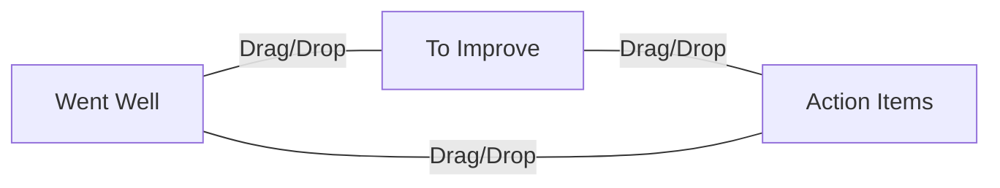

# Kanban-Style Retrospective Board Plan

## Columns

- **Went Well**
- **To Improve**
- **Action Items**

## Features

- Add feedback to any column
- Drag-and-drop cards between columns
- Real-time updates for all participants
- Export session as JSON

## Data Model

```js
{
  text: "Example feedback",
  type: "wentWell" | "toImprove" | "actionItem",
  createdBy: "socket.id",
  timestamp: 123456789
}
```

## UI Wireframe



- Three columns displayed side by side
- Each column contains feedback cards
- Add form/button at the top of each column
- Drag-and-drop to move cards between columns

## Frontend Implementation

- Render three columns, each showing items of that type
- Add feedback form for each column
- Use a drag-and-drop library (e.g., SortableJS) or native HTML5 drag-and-drop
- On move, emit an event to update the item's type on the backend

## Backend Implementation

- Store feedback items with a "type" property
- Handle events for adding feedback to a specific column
- Handle events for moving feedback between columns (update type)
- Broadcast updates to all session participants

## User Flow

1. User adds a "Went Well" item.
2. Item appears in the "Went Well" column for all users.
3. User drags an item from "To Improve" to "Action Items".
4. All users see the item move in real time.