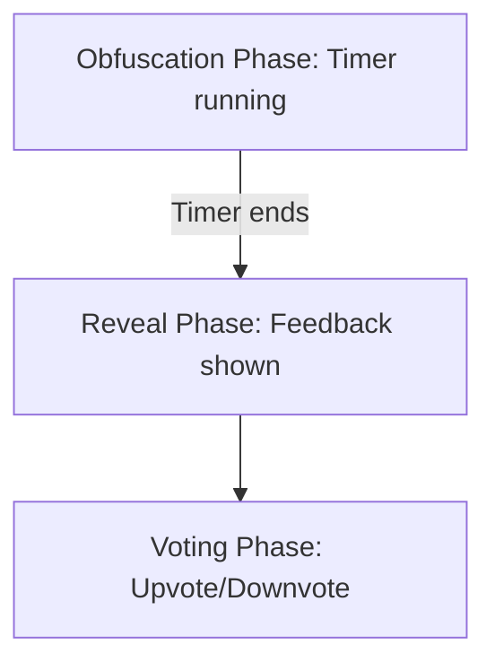

# Retrospective Session Timer & Obfuscation Plan

## Features

- **Configurable Session Timer:**  
  When a session is started, the first participant chooses the timer duration (1-30 minutes).
- **Obfuscation Phase:**  
  During the timer, feedback is obfuscated—participants see only that feedback was added, not the content.
- **Reveal Phase:**  
  When the timer ends, all feedback is revealed to all participants.
- **Voting Phase:**  
  After reveal, participants can upvote or downvote feedback items. Votes are tracked and updated in real time.

---

## Data Model Changes

- **Session:**
  - `startTime`: Timestamp when session started
  - `duration`: Timer duration in minutes (1-30)
  - `phase`: "obfuscate" | "reveal" | "voting"
  - `endTime`: Timestamp when timer ends
- **Feedback:**
  - `text`, `type`, `createdBy`, `timestamp`, `id`
  - `votes`: { [socketId]: 1 | -1 }

---

## Backend Logic

1. **Session Creation:**
   - First participant provides timer duration (validated: 1-30 min).
   - Server stores duration, sets `startTime`, calculates `endTime`.
   - Server manages timer and phase transitions.
2. **Obfuscation:**
   - Feedback is stored with content, but only placeholders are sent to clients.
   - Number of feedback items per column is visible.
3. **Reveal:**
   - At timer end, server broadcasts "reveal" event.
   - All feedback content is sent to clients.
4. **Voting:**
   - After reveal, voting is enabled.
   - Server tracks votes and broadcasts updates.

---

## Frontend Logic

- **Session Start:**  
  Prompt for timer duration (1-30 min) when creating a session.
- **Timer Display:**  
  Show countdown timer to all participants.
- **Obfuscation UI:**  
  Show placeholders for feedback items (e.g., "Feedback added").
- **Reveal UI:**  
  Show all feedback content and enable voting controls.
- **Voting UI:**  
  Upvote/downvote buttons for each feedback item, with real-time updates.

---

## Wireframe (Phases)

---

## User Flow

1. First participant creates session and sets timer (1-30 min).
2. All participants add feedback (obfuscated).
3. When timer ends, feedback is revealed.
4. Participants upvote/downvote feedback.